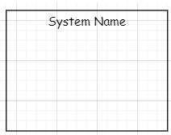
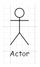
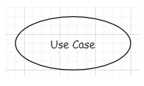
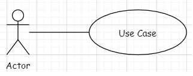
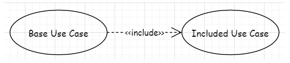
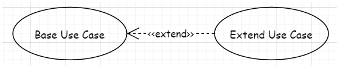
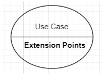
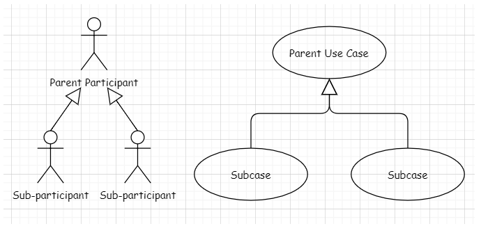

# Use case diagram
(use case diagram) is the simplest representation of the interaction between the user and the system, showing the relationship between the user and his related use cases. Through use case diagrams, people can understand the different types of users and use cases of the system. Use case diagrams are also often used in conjunction with other diagrams.

## Model elements used in this job

### 1.system
Use a rectangular box to represent a system and put the system's name at the top. Everything inside the rectangle belongs to this system, and anything outside the rectangle can use this system.

### 2.Actor
Represent the participant with a small human figure. Participants were placed outside the rectangular box. An actor is someone or something that uses the system. It may be an individual, an organization, another system, or an external device. There are three key factors for participants

1. Participants are external objects of the system and need to be placed outside the system;
2. Participants need to be viewed as types or categories, not as specific individuals or specific organizations. For example, customer refers to all customers, not an individual.
3. Participants are divided into primary participants and secondary participants. The main participants actively initiate actions and are placed on the left side of the system, while the secondary participants are often more passive and are placed on the right side of the system.

### 3.Use Case
Use an ellipse to represent a use case, and write the action completed by the use case inside the ellipse. The use case is placed inside the rectangular box. A use case represents an action of a task in the system that is completed, so the use case belongs to the system. The description of the use case should focus on what kind of behavior the system has from the outside, regardless of how the behavior is implemented inside the system. Use cases all start with a verb and reinforce the action that is happening, and it's best to arrange the use cases logically.

#Relationship
### 4.Association
Using a solid line to connect actors and use cases indicates that actors and use cases are conducting a basic communication or interaction. Note: The association is only used between the executor and the use case. There will be no association between use cases and use cases.

### 5.Include
Use a dotted line with an arrow pointing from the base use case to the containing use case. The inclusion relationship represents the dependency relationship between the basic use case and the included use case. Every time the basic use case is executed, the included use case will also be executed. In other words, the basic use case depends on the included use case. Note: Each time the base use case is called, the containing use case must also be executed.

### 6.Extension
Use a dotted line with an arrow pointing from the extended use case to the base use case. The extended relationship consists of basic use cases and extended use cases. When the basic use case is executed, the extended use case is not necessarily executed. They are only executed when certain conditions are met. Or you can use extended use cases to extend the behavior of basic use cases.

### 7.Extension Point
(Use a solid line to divide the use case into two parts, write the name of the use case in the upper part, and write the extension point of the use case in the lower part. The extension point is just a detailed version of the extension relationship.

### 8.Generalization
Use a triangular hollow arrow with a solid line to represent the generalization relationship. The triangular arrow points from the child to the parent. Child actors inherit all relationships of parent actors, and child use cases inherit all structures, behaviors, and relationships of parent use cases.

#### references
https://blog.csdn.net/thehellovie/article/details/129429312
